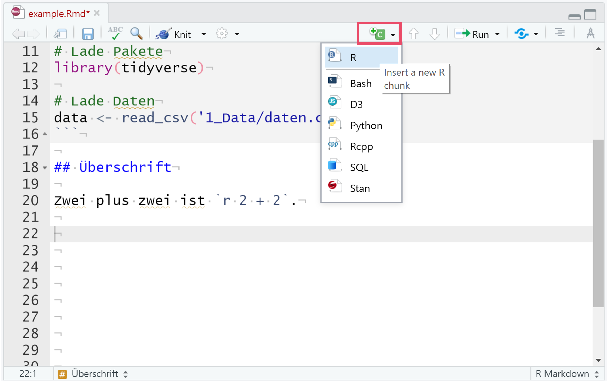

<style>
pre code,  .md:not(.use-csslab) pre code {
  white-space: pre-wrap;
  }
</style>

```{r setup, echo = FALSE, message = FALSE, warning = FALSE}
knitr::opts_chunk$set(comment = NA, 
                      fig.width = 6, 
                      fig.height = 6,
                      fig.align = 'center',
                      echo = FALSE, 
                      eval = FALSE, 
                      warning = FALSE,
                      message = FALSE,
                      tidy.opts=list(width.cutoff=40))

# Lade Pakete
library(tidyverse)
library(knitr)
library(kableExtra)
library(lubridate)

# Lade Daten
# Airbnb <- read_csv('1_Data/Airbnb.csv') 

```

<p align="center" width="100%">
  
  <br>
  <font style="font-size:10px">adapted from <a href="https://news.Airbnb.com/de/unterkunften-fur-covid-19-einsatzkrafte/">Airbnb.com</a></font>
</p>


# {.tabset}

## Überblick

In diesem Practical lernst du einen Bericht mit Markdown zu erstellen. Das Enprodukt ist der `airbnb_solution.html` Bericht im `3_markdown` Ordner.

Am Ende des Practicals wirst du wissen wie man:

1. Text in das Dokument einfügt.
2. Inline Code im Text verwendet. 
3. Chunks erstellt und einstellt. 
4. Grafiken formatiert.
5. Datentabellen einfügt und im Detail gestaltet.
6. Ergebnisse eines Regressionsmodells einbindet.
7. Den YAML header mit einem Inhaltsverzeichnis und einem neuen `theme` ergänzt.
8. Ein zwei Spalten Layout erstellt, dass den Text in der linken und die Grafiken/Tabellen in der rechten Spalte anzeigt.
9. Eine CSS Datei erstellt und in deinen Bericht einbindet.


## Aufgaben

### A - Setup

1. Lade den .zip Ordner mit den Inhalten, die für diese Übung wichtig sind [**von hier**](https://www.dropbox.com/s/jomqnkoz9jucf7v/TheRBootcamp.zip?dl=1) herunter und unzippe ihn.

2. Gehe in den Ordner und öffne dein `TheRBootcamp` R Projekt. Es sollte die Ordner `1_Data`, `2_Assets`, und `3_Markdown` enthalten. 

3. Öffne ein neues RMarkdown Skript und wähle das Template "HTML" aus (siehe screenshot).

<p align="center" width="100%">
  
</p>

4. Trage als Titel `Bericht Berlin 2018/2019` ein.

5. Speichere das neue Markdown Skript unter dem Namen `Airbnb_level_one.Rmd` im `3_Markdown` Ordner ab.

6. Lösche alles unterhalb des `setup` Code Chunks.

7. Lade die Pakete `tidyverse`, `lubridate`, `knitr`, `kableExtra` und `sjPlot` im `setup` Chunk. Ggf. musst du die pakete erst installieren.

```{r, echo = T, eval = T}
# Lade Pakete
library(tidyverse)
library(knitr)
library(sjPlot)
library(kableExtra)
library(lubridate)
```

8. Lade den `airbnb` Datensatz mit `read_csv()` ebenfalls im `setup` Chunk mit dem Code unten.

```{r echo = TRUE}
# Lade Airbnb Datensatz
airbnb <- read_csv("../1_Data/Airbnb.csv")
```

9. Verwende den Code unten um nur die beiden Jahre `2018` und `2019` aus den Daten auszuwählen und ein neues Objekt `airbnb_1819` zu erstellen.

```{r echo = TRUE}
# Wähle Jahre 2018 und 2019 aus
airbnb_1819 <- airbnb %>% 
  filter(Erstellungsdatum > "2018-01-01", 
         Erstellungsdatum < "2019-12-31")
```

### B - Präambel

1. Unter den `setup` Chunk, setze eine Überschrift auf drittem Level (`###`) mit Titel `Präambel`. 

````markdown
### Präambel
````

2. Nun setze unter die Überschrift den folgenden Text. 

````wrap
Dieser Bericht analysiert Veränderungen in den Neueinstellungen und den Preisen von Airbnb Objekten in Berlin, Deutschland. Er wurde zum Zwecke der Übung auf Basis öffentlich verfügbarer Daten erstellt und repräsentiert einzig die Position der Autoren. Es besteht keine Beziehung zu Airbnb.  
````

3. `Knitte` das Dokument. Sieht alles in Ordnung aus?  

### C - Neueinstellungen: Text Teil 1

1. Setze eine weitere Überschrift auf dritter Ebene (`###`) mit Titel `Neueinstellungen` und darunter eine Überschrift auf vierter Ebene (`####`) mit dem Titel `Entwicklung`.

````markdown
### Neueinstellungen

#### Entwicklung
````

2. Füge nun diesen Text ein. Er enthält einige Werte, die du gleich durch inline Code ersetzen wirst.

````wrap
Seit 02.01.2018 wurden in Berlin 5007 Airbnb Wohnungen eingestellt. Von diesen Wohnungn weisen aktuell 73% Verfügbarkeiten von durchschnittlich 47.5 Tagen für die nächsten 3 Monate auf.

Einstellungen von Airbnb Wohnungen haben im letzten Jahr stark zugenommen. Im Jahr 2019 wurden insgesamt 3274 neue Wohnungen eingestellt, wohingegend im Jahr 2018 nur 1733 Wohnungen eingestellt wurden. Dies entspricht einem Zuwachs von 89%.
````

3. Tausche zunächst das Datum an zweiter Stelle im Text durch den folgenden inline Code aus. Nicht vergessen, der Code muss zwischen zwei Gravis (&grave;r Code&grave;) gesetzt werden. Knitte das Dokument.  

````text
r min(airbnb_1819$Erstellungsdatum)
````

4. Jetzt sollte der Text ein Datum enthalten, welches aber noch nicht ganz richtig formatiert ist. Hier hilft die `strftime()` Funktion. Versuche mit dem folgenden inline Code das Datum in das richtige Format zu bringen.   

````text
r strftime(min(airbnb_1819$Erstellungsdatum), "%d.%m.%Y")
````
5. Als nächstes ersetze die Anzahl der Wohnungen durch `nrow(airbnb_1819)`. Nicht das `r` am Anfang vergessen! 

6. Ersetze nun Prozentsatz der Wohnungen durch `round(mean(airbnb_1819$Verfügbarkeit_90Tage > 0) * 100)` und die durchschnittliche Verfügbarkeit durch `round(mean(airbnb_1819$Verfügbarkeit_90Tage[airbnb_1819$Verfügbarkeit_90Tage>0]),1)`. Jetzt sollten alle Zahlen des ersten Absatz durch Code ersetzt worden sein. Überprüfe ob alles stimmt. 

7. Im nächsten Absatz ersetze die ersten beiden Zahlen durch `n_2019 <- sum(year(airbnb_1819$Erstellungsdatum) == 2019); n_2019` und `n_2018 <- sum(year(airbnb_1819$Erstellungsdatum) == 2018); n_2018`. In diesen beiden Fällen siehst du, dass auch Zuweisungen in inline Code möglich sind. 

8. Ersetze nun den wert des Zuwachses am Ende des Absatzes durch `(round(n_2019/n_2018, 2) - 1)*100`, was, wie du siehst, auf die beiden zuvor im inline Code definierten Objekte zurückgreift. Knitte das Dokument und überprüfe, ob nun alle Zahlen einwandfrei wiedergegeben werden.

9. Zuletzt verwende &ast;&ast; um den gesamten zweiten Absatz fett zu setzen. Setze hierfür einmal die zwei Asteriske vor das erste und nach dem letzten Wort des Absatzes. Nun alles wie im Zieldokument?

### D - Neueinstellungen: Grafik Teil 1

1. Erstelle einen neuen Code Chunk. Einen Chunk erstellst du mit zunächst drei Gravis &grave;&grave;&grave;, dann direkt danach in der selben Zeile `{r}` und anschliessend nocheinmal drei Ticks in einer Zeile darunter. Wie in der Abbildung unten sollte sich der Hintergrund automatisch grau einfärben. 

<p align="center"></img></p>

2. Kopiere in den Chunk, d.h., zwischen die zwei Zeilen mit den drei Gravis/Ticks, den Code unten, welcher eine erste Version der ersten Grafik im Bericht generiert. 

```R
# Plotte Häufigkeiten
ggplot(airbnb_1819 %>% 
      group_by(Jahr = year(Erstellungsdatum), 
               Monat_tmp = month(Erstellungsdatum)) %>% 
      summarize(Monat = as_factor(paste(first(Jahr), first(Monat_tmp), sep = '-')),
                Wohnungen = n()), 
      aes(x = Monat, y = Wohnungen, fill = Jahr)) + 
      geom_bar(stat = 'identity', position = 'dodge') + 
      theme(legend.position = 'none',
      axis.text.x = element_text(angle = 45, hjust = 1)) 
```

### E - Chunk-Optionen 

1. Aktuell zeigt dein "geknittetes" Dokument sowohl den Code für den Plot als auch den Plot selbst an. Das Dokument soll aber nur den Plot zeigen. Ergänze in den Chunk Optionen, d.h., innerhalb der geschwungenen Klammern nach dem `r`, `echo = FALSE`. Danach knitte das Dokument nocheinmal.  

<p align="center"></img></p>

2. Das Dokument sollte nun den Code im Chunk nicht mehr anzeigen. Mache nun dieses Setting rückgängig, d.h., lösche `echo = FALSE`, es gibt nämlich einen zweiten Weg diesen und alle zukünftigen Code Chunks zu verstecken. Knitte das Dokument nachdem du das `echo = FALSE` entfernt hast. 

3. Gehe nun zum Setup-Chunk ganz am Anfang es Dokuments (unter dem YAML header). Dort siehst du folgende Code Zeile `knitr::opts_chunk$set(echo = TRUE)`, die aktuell impliziert, dass alle Code Chunks per default angezeigt werden. Setze nun hier `echo = FALSE` und knitte das Dokument. Der Code Chunk sollte nun wieder versteckt sein. Behalte diese Einstellung auch für die weiteren Sessions bei.

4. Ergänze nun zusätzlich in den allgemeinen Chunk-Optionen `message = FALSE` und `warning = FALSE`, was vollständig verhindert, dass Messages oder Warnings im Bericht auftauchen. Die finalen Settings sollten nun so aussehen. 

```R
knitr::opts_chunk$set(echo = FALSE, message = FALSE, warning = FALSE)
```

### F - Neueinstellungen: Text Teil 2

1. Setze unten im Script eine weitere Überschrift auf vierter Ebene (`####`) mit dem Titel `Stadtteile`.

2. Unter die Überschrift setze den folgenden Text.

```wrap
Neueinstellungen fallen nach wie vor sehr unterschiedlich in den Bezirken aus. Die meisten Neueinstellungen im Jahr 2019 gab es in Friedrichshain-Kreuzberg, die wenigsten in Marzahn - Hellersdorf.

Die grössten Veränderungen gab es in Marzahn - Hellersdorf und Treptow - Köpenick. In Marzahn - Hellersdorf schrumpften die Neueinstellungen um -13.3%, in Treptow - Köpenick wuchsen die Neueinstellungen um 137.8%.
```

3. Vor den Text setze den folgenden Chunk, welcher die Häufigkeiten der Neueinstellungen über die Stadtteile berechnet und im Objekt `stadtteile` speichert.

```R
# Berechne Häufigkeiten über die Bezirke
stadtteile <- airbnb_1819 %>% 
              group_by(Stadtteil, 
                       Jahr = year(Erstellungsdatum)) %>% 
              summarize(Wohnungen = n()) %>% 
              ungroup() %>% 
              arrange(desc(Jahr), Wohnungen) %>% 
              mutate(Stadtteil = as_factor(Stadtteil))
```
4. Ersetze nun die die zwei im ersten Paragraph erwähnten Stadtteile durch `stadtteile %>% filter(Jahr == 2019) %>% pull(Stadtteil) %>% last()` und `stadtteile %>% filter(Jahr == 2019) %>% pull(Stadtteil) %>% first()`. 
Knitte das Dokument und schaue, ob die richtigen Namen eingesetzt wurden. 

5. Kreiere einen neuen Chunk zwischen den beiden Absätzen mit dem folgenden Code, welcher einige Objekte erstellt, die die inline Ergänzungen im darauf folgenden Absatz erleichtern werden.  

```
# Veränderung über die Stadtteile
veränderung = stadtteile %>% 
  group_by(Stadtteil) %>% 
  summarize(veränderung = (100 * (Wohnungen[Jahr == 2019]/Wohnungen[Jahr == 2018] - 1)) %>% round(1))

# Geringsten Veränderung
min_veränderung = veränderung %>% 
  slice(which.min(veränderung)) %>% 
  pull(veränderung)

# Stadteil mit der geringsten Veränderung
min_stadtteil = veränderung %>% 
  slice(which.min(veränderung)) %>% 
  pull(Stadtteil)

# Grösste Veränderung
max_veränderung = veränderung %>% 
  slice(which.max(veränderung)) %>% 
  pull(veränderung)

# Stadteil mit der grössten Veränderung
max_stadtteil = veränderung %>% 
  slice(which.max(veränderung)) %>% 
  pull(Stadtteil)
```

6. Ersetze die ersten beiden Stadtteil-Nennungen in beiden Sätzen durch `min_stadtteil` und `max_stadtteil` und knitte das Dokument. Passt alles?

7. Ersetze nun `schrumpften` und `wuchsen` durch `ifelse(min_veränderung > 0, "wuchsen", "schrumpften")` und `ifelse(max_veränderung > 0, "wuchsen", "schrumpften")`. Die beiden Codestücke können dann selbst entscheiden, ob die Veränderung eine positive oder negative ist und das jeweils richtige Wort einsetzen. 

8. Abschliessend ersetze die beiden numerischen Werte durch `min_veränderung` und `max_veränderung`. 
Knitte das Dokument und überprüfe, ob alles in Ordnung ist.

### G - Neueinstellungen: Grafik Teil 2

1. Erstelle einen neuen Chunk mit dem folgenden Code für die zweite Grafik.

```R
# Plotte Häufigkeieten der Stadtteile
ggplot(stadtteile, 
       aes(y = Stadtteil, x = Wohnungen, group = Jahr, fill = Jahr)) + 
       geom_bar(stat = 'identity', position = 'dodge') + 
       theme(legend.position = 'none') + 
       labs(y = '')
```

2. Knitte das Dokument. Der erste Teil ist hiermit abgeschlossen. 

### H - Präambel: Fussnote einfügen

1. Ergänze eine Fussnote nach dem Texteil 'verfügbarer Daten' `^[Daten wurde heruntergeladen von [insideairbnb.com](http://insideairbnb.com/get-the-data.html)]`

2. `Knitte` das Dokument. Siehst du nun eine Fussnote am Ende des Dokuments?  

### I - Neueinstellungen: Plots

1. Nun geht es darum die Darstellung der Grafiken zu verbessern und Bildunterschriften einzufügen. Setze zunächst das Seitenverhältnis der ersten Grafik auf .5 (`fig.asp = .5`). Knitte das Dokument. Die Grafik sollte nun schmaler sein.

2. Füge `fig.cap = cap` in den Optionen des Chunks der ersten Grafik ein. Dies wird dir ermöglichen gleich die Bildunterschrift im Chunk zu definieren.

3. Am Ende des Grafik Chunks ergänze nun `cap = "Abbildung 1. Neueinstellungen pro Monat."`. Knitte das Dokument. Du solltest nun eine Bildunterschrift sehen.

4. Weitere zur nächsten Grafik. Setze das Seitenverhältnis für die zweite Grafik auf .5.

5. Füge nun zunächst `fig.cap = cap` in den Optionen des Chunks der zweiten Grafik ein und dann innerhalb des Chunks `cap = Abbildung 2. Neueinstellungen pro Bezirk.`. 

6. `Knitte` das Dokument. Sieht alles in Ordnung aus?  

### J - Preise: Neuer Texteil

1. Für einen neuen Abschnitt füge `Preis` als Level 3 Header ein.

2. Setze darunter den folgenden Text.

````wrap
Der durchschnittliche Preis der Neueinstellungen beträgt 80.8 €. Im Vergleich zum Vorjahr sind die Preise der Neueinstellungen um 1.7% gestiegen.
````

3. In diesem Text werden die Zahlen nicht berechnet - füge inline Code für den durschschnittlichen Preis aus dem Datensatz `airbnb_1819` direkt im Text ein. Siehe unten.

```R
round(mean(airbnb_1819 %>% pull(Preis)),1)
```

4. Wähle die gleiche Vorgangsweise für die prozentuelle Steigerung der Preise. Verwende folgenden Code für die Berechnung innerhalb des Texts. 

```R
m <- mean(airbnb_1819 %>% filter(year(Erstellungsdatum) == 2019) %>% pull(Preis))/ mean(airbnb_1819 %>% filter(year(Erstellungsdatum) == 2018) %>% pull(Preis)) ; round(m, 3) * 100 - 100
```

5. `Knitte` das Dokument. Sieht alles in Ordnung aus?  

### K - Preise: Neuer Texteil

1. Erstelle eine neue Überschrift, `Einfluss Ausstattung`, als Level 4 Header.

2. Berechne als ersten Schritt in einem eigenem Code Chunk wie sich die verschiedenen Ausstattungsmerkmale (Küche, Wifi, ...) auf die durchschnittlichen Preise auswirken. 

```R
# Vektor mit Ausstattungsmerkmalen
ausstattung_var <- c('Küche','Wifi','TV','Kaffeemaschine',
                     'Geschirrspüler','Terrasse_Balkon',
                     'Check_in_24h')

# Bestimme Preise als Funktion der Ausstattungsmerkmale
ausstattung <- 
  airbnb_1819 %>% 
    select(all_of(ausstattung_var), Preis) %>%
    pivot_longer(-Preis,
    names_to = 'Ausstattung',
    values_to = 'Ausstattung_vorhanden') %>% 
    group_by(Ausstattung) %>% 
    summarize(Nicht_vorhanden = mean(Preis[!Ausstattung_vorhanden]),
              Vorhanden = mean(Preis[Ausstattung_vorhanden]),
              Differenz = Vorhanden - Nicht_vorhanden, 
              Prozent_vorhanden = mean(Ausstattung_vorhanden) * 100) %>% 
    arrange(desc(Differenz)) 
```

3. Füge einen neuen Textteil ein.

````wrap
Das Austattungsmerkmal mit dem grössten Unterschied im Preis ist Check_in_24h (72.9), das Austattungsmerkmal mit dem kleinsten Unterschied im Preis ist Küche (-88.9).
````

4. Ersetze den Variablenamen und den numerischen Wert in Klammer (grösster Unterschied im Preis) mit zwei separaten inline Code-Elementen.

```R
ausstattung %>% pull(Ausstattung) %>% first()
ausstattung %>% pull(Differenz) %>% first() %>% round(1)
```

5. Ersetze genauso Variablename und numerischen Wert in Klammer für den kleinsten Unterschied im Preis.

```{R
ausstattung %>% pull(Ausstattung) %>% last()
ausstattung %>% pull(Differenz) %>% last() %>% round(1)
```

6. Der folgenden Textabschnitt beinhaltet eine Schlussfolgerung aus den Ergebnissen der Tabelle. Kennzeichne den Textabschnitt mit &ast;&ast; vor und nach dem ersten Wort und setze ihn damit in fetter Schriftart.

````wrap
Der stark negative Effekt der Küche überrascht, er könnte jedoch durch die Art der Unterkunft moderiert werden, gegeben dass auch Hotels im Angebot enthalten sind.
````

7. `Knitte` das Dokument. Sieht alles in Ordnung aus?  

### L - Preis: Tabelle 1 erzeugen

1. Erstelle einen neuen Code Chunk mit einer Tabelle basierend auf `ausstattung`. Verwende dafür die `kable()` Funktion. Siehe unten.

```R
# Plotte Tabelle mit Austattungsmerkmalen
ausstattung %>% kable(format = 'html')
```

2. Beschränke die Anzahl Nachkommastellen mit `digits = 2` auf zwei.

3. Füge eine Tabellenüberschrift mit `caption = 'Tabelle 1. Austattung und Einfluss auf den Preis'` ein.

4. Passe die Namen der Spalten an, inklusive neuer Zeilenumbrüche mit `<br>`: `col.names = c('', 'Preis<br>Nicht-vorh.', 'Preis<br>vorh.', 'Differenz', 'Prozent<br>vorh.')`

5. `Knitte` das Dokument. Du wirst bemerken, dass die Spaltenbeschriftung nicht korrekt übersetzt wird. Verwende als weiteres Argument `escape = FALSE` um dieses Problem zu korrigieren. 

6. Lege die Ausrichtung der Zellen mit `align = "lcccc"` fest. Jeder Buchstabe legt die Ausrichtung für eine Spalte fest. `l` bedeutet left und `c` center.

7. Nun vergrössere die Breite der Spalten in dem du `column_spec()` hinter der `kable()` Funktion verwendest. 

```R
ausstattung %>% 
  kable(...) %>% 
  column_spec(c(2,3,4,5), width = "1.2in")
```

8. Abschliessend, gestalte die Schrifgrösse der Zellen in Abhängigkeit der Grösse der abgebildeten Zahl. Füge dafür vor der `kable()` Funktion folgenden Code ein und verbinde die beiden Teile mit einer Pipe `%>%`.

```R
ausstattung %>% 
  mutate_if(is.numeric, function(x) {
            cell_spec(round(x,1), bold = T, 
            font_size = spec_font_size(x, begin=10, end=16))}) %>% 
  kable(...) %>% 
  column_spec(...)
```

9. `Knitte` das Dokument. Sieht alles in Ordnung aus?  

### M - Preise: Text Teil

1. Erstelle eine neue Überschrift, `Regressionsmodell`, als Level 4 Header

2. Verwende den Code unten um eine Regression in der `Preis` durch verschiedenen Ausstattungsmerkmalen und den Status Hotel Ja/Nein vorhergesagt wird. 

```R
# Reduzierter Vektor mit Ausstattungsmerkmalen
ausstattung_var <- c('Küche','TV','Terrasse_Balkon','Check_in_24h')

# Bereit den Datensatz für die Regression vor
ausstattung <- 
  airbnb_1819 %>% 
    mutate(Hotel = Unterkunftsart %in% c('Boutique hotel', 'Hotel')) %>% 
    select(Preis, Hotel, all_of(ausstattung_var)) 

# Rechne Regression des Preises auf Austattungsmerkmale und Hotel
ausstattung_mod <- 
  ausstattung %>% 
    lm(formula = Preis ~ .)
  
# Bestimme Anteil Hotels in 2018 und 2019
hotel <- 
  airbnb_1819 %>% 
    group_by(year(Erstellungsdatum)) %>% 
    summarize(Anteil = mean(Unterkunftsart %in% c('Boutique hotel', 'Hotel')))   
```

3. Füge nun folgenden Textblock ein.

`````wrap
Die Regression legt nahe, dass Küche, TV und Terrasse oder Balkon den grössten Einfluss auf den Preis in denletztene beiden Jahren hatten.

Der Einfluss der Küche ist gegenüber dem Unterschied in Tabelle 1 gesunken, jedoch nach wie vor signifikant.

Überraschenderweise ist der Effekt eines 24h Check-ins, welcher deskriptiv am grössten ausfiel, nicht signifikant. Dies ist ebenfalls auf den Zusammen zur Unterkunftsart zurückzuführen

Es besteht ein substantieller Unterschied im Preis zwischen Unterkunftsarten. Hotels haben eine um 437.3€ höheren Preis als Unterkünfte die keine Hotels sind.

Der Anteil von Hotels ist von 1.1% im Jahre 2018 auf 1.4% im Jahre 2019 gestiegen. Es liegt nahe, dass der Anstieg im Anteil der Hotels, den Anstieg der Objektpreise verursacht.
`````

4. Lasse dir die Koeffizienten aus dem Regressionsmodell ausgeben und verwende den Code unten um im vierten Absatz (Hotels haben einen um ... höheren Preis) das Ergebnis im Satz zu ersetzen.

```R
coefficients(ausstattung_mod)['HotelTRUE'] %>% round(1)
```

5. Hebe zum Abschluss den 2. ("Überraschenderweise ...") und 4. Absatz ("Der Anteil ...") fett hervor.

6. `Knitte` das Dokument. Sieht alles in Ordnung aus?  

### N - Preise: Regressionstabelle

1. Zeige die Regressionsergebnisse in einer Tablle mit der `tab_model()` Funktion an.

```R
# Tabelle mit Ergebnissen der Regression
tab_model(ausstattung_mod)
```
2. Ersetze die Namen der Koeffizienten in der Tabelle mit dem Argument `pred.labels = c('Achsenabschnitt', names(ausstattung)[-1])`

3. Füge einen neuen Tabellentitel mit dem Argument `title = 'Table 2. Regression des Preises auf die Ausstattung.'` ein. 

4. `Knitte` das Dokument. Sieht alles in Ordnung aus?  

### O - YAML erweitern

1. Um Einstellungen des Dokuments vornehmen zu können füge zunächst hinter `html_document` im YAML Header einen Doppelpunkt hinzu. 

2. Füge nun in einer Zeile darunter `toc: true` hinzu um ein Inhaltsverzeichnis zu ergänzen. Stelle sicher, dass `toc: true` gegenüber `html_document:` eingerückt ist. Knitte das Dokument. Siehst du alle Überschriften im Inhaltsverzeichnis?

3. Damit alle Überschriften Levels angezeigt werden ergänze in einer weiteren Zeile (selbe Ebene wie `toc: true`) den Befehl `toc_depth: 5`. 

4. Knitte das Dokument. Wird der Abschnitt Neueinstellungen mit zwei Unterkapiteln Entwicklung und Stadteile angezeigt? 

5. Füge in einer neuen Zeile: `includes:` hinzu und dann darunter eingrückt `in_header: ../2_Assets/header.Rhtml` ein. Damit lädst du eine kleine HTML Vorlage für den Kopf des Berichts. 

6. Knitte das Dokument. Hat sich die Anzeige des Titels und Untertitels verändert? Ist das AirBnB Logo zu sehen?

7. Entferne nun die Zeile mit `title:` aus dem YAML Header, da jetzt kein zweiter Titel benötigt wird.

8. Als letztes Gestaltungselement ergänze `theme: lumen` auf der selben Ebene wie `toc: true` oberhalb von `includes:`, womit verschiedene Eigenschaften des Schriftbildes angepasst werden (<a href = 'https://www.datadreaming.org/post/r-markdown-theme-gallery/'>hier</a> findest du eine Übersicht über weitere Themes)

9. Knitte das Dokument. Sieht alles in Ordnung aus?  

### P - Grafiken

1. Als ersten Schritt um die Grafiken weiter anzupassen, ergänze in den allgemeinen Chunk-Optionen (`knitr::opts_chunk$set()`) im `setup` Chunk das Argument `dev.args = list(bg = "transparent")`.

2. Nun ergänze im `setup` Chunk folgenden Code, welcher das `theme` der `ggplot` Grafiken auf `theme_minimal` setzt. Knitte das Dokument. Hat sich etwas verändert?

```R
theme_set(theme_minimal())
```

3. Ergänze nun darunter folgenden Code um dafür zu sorgen, dass die Hintergründe der Grafiken transparent sind. 

```R
theme_update(panel.background = element_rect(fill = "transparent", colour = NA),
             plot.background = element_rect(fill = "transparent", colour = NA))
```

4. Gleich darunter, im `setup` Chunk, stelle mit folgendem Code die Farbpaletten der ggplot Grafiken auf die AirBnB Farben ein.

```R
ggplot <- function(...) ggplot2::ggplot(...) + 
  scale_fill_gradientn(colors = c('#555555','#6BB7B9')) + 
  scale_colour_gradientn(colors = c('#555555','#6BB7B9'))
```

5. `Knitte` das Dokument. Hat sich der Hintergrund und die Farbpalette der Grafiken verändert?  

### Q - CSS Funktionen anpassen

1. Die Bildunterschriften sind noch nicht zentriert. Setze das HTML Tag `center` um die beiden `cap` Definitionen der Grafiken. Siehe Code. 

```R
"<center>Abbildung 1. Neueinstellungen pro Monat</center>"
"<center>Abbildung 2. Neueinstellungen pro Bezirk</center>"
```

2. In der Regressions-Tabelle, die Du mit `sjPlot` erstellt hast, ergänze `CSS = list(css.caption = "font-weight: 500")` um die Schrift anzupassen

3. Im gleichen Argument füge `css.table = "width: auto; margin-right: 0px;margin-left: auto;"` zusätzlich in die `list` ein, um die Tabelle rechts auszurichten.

### R - Layout in 2 Spalten setzen

Setze folgenden HTML Code im Abschnitt Entwicklung ein - damit positionierst du den Text in die linke Spalte und die Grafik in die rechte Spalte. 

1. Um nun die Berichtinhalte in zwei Spalten zu trennen - Text links, Abbildung rechts - setze zwischen `#### Entwicklung` und dem ersten Absatz "Seit ..." folgenden HTML Code ein. Noch nicht Knitten!

```R
<table>
  <col width = 40%>
  <col width = 10%>
  <col width = 50%>
  <tr>
  <td>
```
2. Ergänze nun zwischen dem zweitem Absatz und dem Grafik-Chunk den folgenden Code. Noch nicht Knitten!
```R
  </td>
  <td>
  
  </td>
  <td>
```

3. Schliesslich ergänze zwischen dem Grafik-Chunk und `#### Stadtteile` den folgenden Code, welcher die HTML Tabelle abschliesst. 

```R
  </td>
  </tr>
</table>
```

4. Knitte jetzt das Dokument. Sind der Text und die Grafik nun in 2 Spalten gesetzt?  

5. Für die weiteren Abschnitte gehe gleich vor. Zwischen `#### Stadtteile` und dem Code-Chunk für die Berechnung der Häufigkeiten über die Bezirke fügen den folgnden HTML Code ein. Noch nicht Knitten!

```R
<table>
  <col width = 40%>
  <col width = 10%>
  <col width = 50%>
  <tr>
  <td>
```
6. Nach dem in fett gesetzten Absatz "Die grösste Veränderung..." und dem Grafik-Chunk füge den folgenden Code ein. Noch nicht Knitten!

```R
  </td>
  <td>
  
  </td>
  <td>
```

7. Schliesslich ergänze nach dem Grafik-Chunk und vor `### Preis` folgende HTML code um die Tabelle abzuschliessen.

```R
  </td>
  </tr>
</table>
```

8. Knitte jetzt wieder das Dokument. Sind der Text und die Grafik nun in 2 Spalten gesetzt? 

9. Für den Abschnitt `###Preis` gehe gleich vor. Ergänze nach dem ersten Code-Chunk mit Berechnungen zur Ausstattung und vor dem ersten Absatz den folgenden Code. Noch nicht Knitten!

```R
<table width=100%>
<col width = 25%>
<col width = 10%>
<col width = 65%>
<tr>
  <td>
```
10. Nach dem zweiten, fett gesetzten Absatz und dem Grafik Chunk füge folgenden Code ein. Noch nicht Knitten!

```R
  </td>
  <td>
  
  </td>
  <td>
```

11. Ergänze nach dem Grafik Chunk und vor `#### Regressionsmodell` den Abschluss der Tabelle. 

```R
  </td>
  </tr>
</table>
```

12. Knitte jetzt wieder das Dokument. Sind der Text und die Grafik nun in 2 Spalten gesetzt? 

13. Setze den letzten Abschnitt selbständig mit einer HTML Table (widths 50%, 10%, 40%) in 2 Spalten. 

14. Knitte wieder das Dokument. Der gesamte Text ist nun in 2 Spalten gesetzt mit den Textinhalten links und den Grafiken bzw. Tabellen rechts. 

### S - CSS

1. Um allgmeine Gestaltungsmkermale des gesamten HTML-Berichts zu ändern erstelle die Datei `my_airbnb.css` und speichere sie in `2_Assets` ab. Du kannst die Datei direkt in RStudio erstellen und mit `.css` als Extension speichern. 

2. Binde nun die leere Datei im YAML Header deines Airbnb Markdown Dokumentes ein. Dafür ergänze `css: ../2_Assets/airbnb.css` unter `html_document:` (selbe Ebene wie `toc: true`)

3. Füge den folgenden Code in `my_airbnb.css` hinzu um die vertikale Ausrichtung der Tabellen anzupassen. Speichere die `.css` Datei und knitte dein Markdown Dokument. 

```CSS
table td {
  vertical-align: top;
  }
```

4. Ergänze weiterhin folgenden Code `my_airbnb.css` um Schriftart und Farbe der beiden Überschriftenlevel anzupassen. Die `.css` Datei speichern und knitten. 

```CSS
h3, h4 {
  font-weight: 500;
  color: #555555;
}
```

5. Um sowohl die Farbe des Links, als auch den Mouseover Effekt (Link verändert sich, wenn der Mauscursor auf den Link zeigt) an das Farbschema anzupassen ergänze folgenden Code in `my_airbnb.css` und knitte das Dokument.

```R
a, a:hover {
  color: #007D8C;
  }
```

6. Als letztes Designelement wirst du nun ein Wasserzeichen als Hintergrundbild einfügen. Ergänze dafür den folgenden Code in deiner `my_airbnb.css` Datei und knitte das Dokument.

```R
body {
  background-image: url(watermark.svg);
  background-repeat: repeat-y;
  background-size: contain;
  }
```

7. Knitte dein Dokument. Du solltest nun einen wohlformatierten AirBnB Bericht vor dir haben. 

8. Speichere das fertige Dokument unter: `3_Markdown/airbnb_final.Rmd` ab.


## Datensatz

Der [Airbnb.csv](https://raw.githubusercontent.com/therbootcamp/RmR_2020Apr/master/_materials/case/Airbnb.csv) Datensatz enthält Zahlen zu 9868 Berliner Airbnbs 


|Variable | Beschreibung |
|:-------------|:-------------------------------------|
|Preis| Preis pro Nacht|
 |Erstellungsdatum| Eröffnungsdatum des Airbnbs |
 |Unterkunftsart| Appartement, Loft, Haus, etc.|
 |Schlafplätze| Anzahl Schlafplätze |
 |Schlafzimmer| Anzahl Schlafzimmer |
 |Badezimmer| Anzahl Badezimmer |
 |Reinigungsgebühr| Reinigungsgebühr |
 |Verfügbarkeit_90Tage| |
 |Viertel| In welchem Viertel befindet sich das Airbnb |
 |Stadtteil| In welchem Stadtteil befindet sich das Airbnb |
 |Breitengrad| Breitengrad|
 |Längengrad| Längengrad |
 |Host_id| Host id |
 |Host_seit| Erfahrung des Hosts |
 |Host_antwortzeit| Host Antwortzeit|
 |Host_antwortrate| Host Antwortrate |
 |Host_superhost| Superhost Ja/Nein |
 |Host_anzahl| Anzahl Gäste |
 |Rating_gesamt| Gesamtrating |
 |Rating_genauigkeit| Genauigkeitsrating |
 |Rating_sauberkeit| Sauberkeitsrating |
 |Rating_checkin| Checkinrating |
 |Rating_kommunikation| Kommunikationsrating |
 |Rating_lage| Lagerating |
 |Rating_wertigkeit| Wertigkeitsrating |
 |Küche| Küche vorhanden TRUE/FALSE |
 |Wifi| WLAN vorhanden TRUE/FALSE |
 |TV| TV vorhanden TRUE/FALSE |
 |Kaffeemaschine| Kaffeemaschine vorhanden TRUE/FALSE|
 |Geschirrspüler| Geschirrspüler vorhanden TRUE/FALSE|
 |Terrasse_Balkon| Terrasse/Balkon vorhanden TRUE/FALSE|
 |Badewanne| Badewanne vorhanden TRUE/FALSE|
 |Check_in_24h| 24h Check-In vorhanden TRUE/FALSE|


## Funktionen

### Paket

|Paket| Installation|
|:------|:------|
|`tidyverse`|`install.packages("tidyverse")`|
|`lubridate`|`install.packages("lubridate")`|
|`knitr`|`install.packages("knitr")`|
|`sjPlot`|`install.packages("sjPlot")`|
|`kabelExtra`|`install.packages("kableExtra")`|


### Funktionen


| Funktion| Paket | Beschreibung |
|:---|:------|:---------------------------------------------|
| `strftime`|`lubridate`| Formatierung von Daten |
| `ggplot`|`ggplot`| Erstellen von Grafiken | 
| `scale_fill_gradientn`|`ggplot`| Erstellt eine Farbpalette | 
| `scale_colour_gradientn`|`ggplot`| Erstellt eine Farbpalette | 
| `theme_set`|`ggplot`| Festlegung und Gestaltung von themes | 
| `kable()`|`knitr`|Tibble (Data frame) als Tabelle| 
| `cell_spec()`, `column_spec`|`kableExtra`|Formatiere Zellen und Spalten in `kable`-Tabelle| 
| `tab_model()`|`sjPlot`|Tabelle mit den Ergebnissen statistischer Modelle| 
| `coefficients()`|`stats`|Zeiege Koeffizienten einer Regression| 
| `pivot_longer()`|`tidyr`|Extrahieren eines Vektors| 


## Materialien

- Allgemeiner Einstieg in [**RMarkdown**](https://rmarkdown.rstudio.com/lesson-1.html).
- [**DIE Referenz**](https://bookdown.org/yihui/rmarkdown/) für RMarkdown bis ins letzte Detail.
- [**Rmarkdown**](https://cran.r-project.org/web/packages/rmarkdown/index.html) Dokumentation und Befehlsreferenz.


