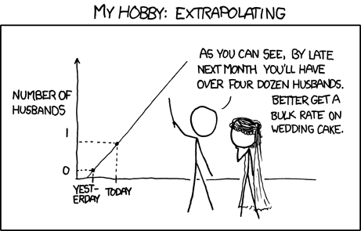

layout: true

<div class="my-footer">
  <span style="text-align:center">
    <span> 
      
    </span>
    <a href="https://therbootcamp.github.io/">
      <span style="padding-left:82px"> 
        <font color="#7E7E7E">
          www.therbootcamp.com
        </font>
      </span>
    </a>
    <a href="https://therbootcamp.github.io/">
      <font color="#7E7E7E">
       Reporting mit R | Februar 2021
      </font>
    </a>
    </span>
  </div> 

---

```{r setup, include=FALSE}
options(htmltools.dir.version = FALSE)
options(width = 110)
options(digits = 4)

# Load packages
require(tidyverse)

# load color set
source("../../_materials/palette/therbootcamp_palettes.R")

# knitr options
knitr::opts_chunk$set(dpi = 300, echo = FALSE, warning = FALSE, fig.align = 'center', message= FALSE)

# special print function: avoid if possible
print2 <- function(x, nlines=10,...) {
   cat(head(capture.output(print(x,...)), nlines), sep="\n")}

```


# TITEL

.pull-left4[

<ul>
  <li class="m1"><span>Teile den slide vertical mit links text und rechts Abbildung, code, etc.</span></li>  
  <li class="m2"><span>40-50 ist idealer split. immer mindestens 10 abstand.</span></li>
  <li class="m3"><span>Verwende, wo möglich numbered bullets, mit kurzen, prägnanten Aussagen: Omit needless words!.</span></li>
  <li class="m4"><span>Hervorhebung.</span></li>
  <ul class="level">
    <li><span>Verwende das tag "high" <high>um Wörter hervorzuheben</high></li></span>
    <li><span>Vermeide italic oder underline</li></span>
  </ul>
</ul>

]

.pull-righ5[

<p align = "center">
  <br>
  <font style="font-size:10px">from <a href="https://lifehacker.com/four-common-statistical-misconceptions-you-should-avoid-906056582">lifehacker.com</a></font>
</p>


]

---

class: middle, center

<h1><a href="https://therbootcamp.github.io/SmR_2020Jun/_sessions/_template/LinearModelsI_practical.html">Practical</a></h1>

